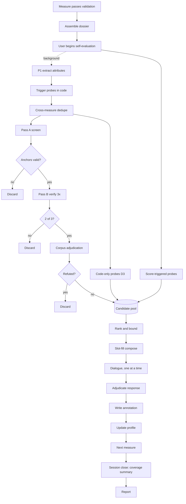
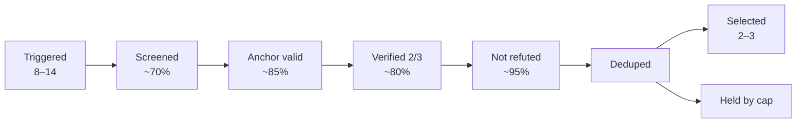

# Dr Transition — Systemic Blind-Spot Probing Module

## Implementation Specification v1.0

**Status:** Design reference for development
**Scope:** Post-validation, per-measure systemic and justice probing on the FITTER Digital Platform
**Runtime target:** LLM 1 (~12B, local), offline after first login
**Depends on:** Hazard & Mitigation Clarification and Validation Methodology; User Self-Evaluation Methodology; D5.2 System Architecture

---

## 1. Purpose

After a mitigation measure has been validated and self-evaluated, this module examines it through the lenses of systems thinking and systems inquiry, surfaces blind spots the user has not addressed, and invites the user to respond in their own words. The responses are appended to the measure as a new sub-section. An internal coverage profile is computed for research purposes.

The module answers a different question from every stage that precedes it.

| Stage | Question it asks | Epistemic posture |
| --- | --- | --- |
| Clarification | What did the user mean? | Interpretive |
| Validation | Does the evidence support this? | Corroborative |
| Self-evaluation | How does the user rate this? | Elicitive |
| **Systemic probing** | **What does this measure fail to see?** | **Critical** |

### 1.1 The central design problem

Validation is corroborative: nothing enters the record without a citation. A vetted corpus, however, almost never contains a sentence of the form *"measure X ignores the delayed feedback in Y."* Applying the citation rule to blind spots would render the module silent.

Conceptual blind spots must therefore be permitted, flagged as unproven. This creates the opposite risk: **an LLM asked to find blind spots will always find them**, including in a well-designed measure. Confabulated critique that sounds systemic will destroy user trust within two or three sessions.

The module resolves this with two structural controls rather than a citation rule.

### 1.2 Control 1 — The anchor rule

> A blind spot may be conceptually ungrounded, but it must be **structurally grounded**. Every candidate must name at least the required number of concrete artefacts from the current session — a specific measure, hazard, disadvantaged group, self-evaluation score, survey predictor, or prior measure. Anchors are validated against the dossier **in code**. Candidates naming artefacts that do not exist are discarded before the user sees them.

**Why this works.** Vague critique becomes structurally impossible. *"This measure may have unintended consequences"* names nothing and dies. *"Measure 3 requires a 40% co-payment from households in the same group Measure 1 identified as being in utility arrears"* names four artefacts and survives. The rule converts a fluency problem into a data problem, which is the only kind enforceable deterministically.

**Secondary benefit.** The anchor set doubles as a dependency graph, giving exact invalidation scope when a measure is later revised (§12).

### 1.3 Control 2 — Detection, not generation

The library ships **pre-written probes**: expert-authored observation patterns with empty slots. The local model is never asked *"what is wrong with this measure?"* It is asked:

> *Does pattern P hold for this measure? Yes or no. If yes, name the artefacts that make it hold.*

This converts open-ended critique — the weakest thing a 12B model does — into **classification with evidence extraction**, which it does reliably.

| Consequence | Effect |
| --- | --- |
| Confabulation | The model cannot invent a novel critique. Worst available failure is a false positive on a real pattern — recoverable and measurable |
| Output size | Boolean plus a handful of IDs. Cheap to generate, trivial to constrain, cheap to sample repeatedly |
| Language quality | Observation and question text is expert-written and slot-filled. Model prose is removed from the critical path entirely |
| Evaluation | Probes have measurable firing rates and precision. Improvement becomes a number, not an impression |

**The cost, stated plainly.** The module cannot surface a blind spot nobody anticipated. This is a genuine loss and should be acknowledged in any publication. The judgement is that an unanticipated *true* insight from a 12B model is rare, whereas unanticipated *plausible fabrication* is common; in a tool whose value proposition is epistemic discipline, the second failure costs more than the first gains. The library is versioned, so patterns discovered in policymaker testing enter as probes in later versions.

---

## 2. Placement

The module runs **per measure**, immediately after that measure's self-evaluation, inside the loop that already exists in the platform workflow.

```
Set context
   │
   ├─ Identify hazards ──────────────────────────┐
   │                                              │
   └─► For each mitigation measure:               │
         propose                                  │
         clarify (5-round ladder)                 │
         validate (grounded, 6 dimensions)        │
         self-evaluate (transformative +          │
                        feasibility)              │
         ►► SYSTEMIC PROBING ◄◄                   │
         next measure ────────────────────────────┘
   │
   ├─ Coverage summary (non-interactive, code only)
   └─ Report
```

### 2.1 Why per measure rather than at session close

| Reason | Detail |
| --- | --- |
| **Context is loaded** | The user is still holding their reasoning about this measure. At session close they must reconstruct it for each of five measures. Free-text response quality is the entire output of this module |
| **Learning feeds forward** | A blind spot surfaced on measure 1 informs the design of measure 2. At session close, every measure is already written. This converts the module from assessment into scaffolding — the decisive argument for a pedagogical platform |
| **Failure is contained** | A weak run costs one interaction rather than degrading the session's closing experience |
| **Peak compute drops** | Pairwise portfolio comparisons distribute across the session instead of batching at the end. Material on mid-range hardware |

### 2.2 What per-measure placement costs

Session-level analyses that cannot run per measure:

| Analysis | Recoverable? | Handling |
| --- | --- | --- |
| Measure–measure interaction | **Yes** — compare measure N against each prior measure | Incremental, probe D1 |
| Cumulative burden on one group | **Yes** — fires when measure N targets a group an earlier measure already targets | Incremental, probe D2 |
| Leverage-depth concentration | **Yes** — classify N, compare against running distribution | Incremental, probe D3 |
| Hazard coverage gaps | **No** — not knowable until the user stops adding measures | Session close, code only (§13) |
| Group coverage gaps | **No** | Session close, code only (§13) |

Four of five portfolio analyses survive intact, and three land harder because they arrive while the user can still act on them.

### 2.3 Skip

The module is skippable. A forced reflection produces one-line dismissals that pollute the annotation record and teach nothing, and it sits badly with the platform's principle that every decision stays with the user. Skips are recorded as telemetry.

---

## 3. Offline constraints and how they are met

| Constraint | Consequence | Mitigation |
| --- | --- | --- |
| No LLM 2 escalation | Portfolio synthesis across N measures at once is beyond a 12B model | Decompose into pairwise binary comparisons (§8.4) and pure-code set operations |
| Open-ended generation unreliable | Confabulation | Detection-not-generation (§1.3) |
| Structured output unreliable | Pipeline breakage | Grammar-constrained decoding, mandatory (§15.1) |
| Compute is real | Triple-sampling everything is too slow | Screen-then-verify (§8.5) plus background precompute during self-evaluation (§8.6) |
| Model may be unavailable | Module produces nothing | Deterministic fallback path — code-only analyses always run (§14) |

---

## 4. Data model

### 4.1 MeasureDossier

Assembled by code when a measure passes validation. This is the sole input to all downstream stages.

```jsonc
{
  "session_id": "…",
  "context": { "country": "IT", "region": "…", "sector": "energy" },

  "hazards": [{
    "hazard_id": "EN-H1",
    "label": "Heating and cooling costs increase",
    "source_category": "survey | expert | platform",
    "statistical_basis": { "mean_concern": 15.37, "high_concern_pct": 73.0 },
    "affected_groups": ["G-ARREARS", "G-HOMEPROB"]
  }],

  "survey_predictors": [{
    "predictor_id": "EN-H1-P1A",
    "hazard_id": "EN-H1",
    "name": "utility_arrears (twice or more)",
    "odds_ratio": 3.00,
    "direction": "higher",
    "p_value": 0.0009
  }],

  "disadvantaged_groups": [{
    "group_id": "G-ARREARS",
    "label": "Households in utility arrears",
    "source": "survey_predictor | expert | user_added",
    "linked_hazards": ["EN-H1", "EN-H4"]
  }],

  "measures": [ /* all validated measures so far, ordinal-ordered */ ],
  "current_measure_id": "M3"
}
```

### 4.2 MeasureRecord

```jsonc
{
  "measure_id": "M3",
  "ordinal": 3,
  "hazard_id": "EN-H1",
  "frozen_description": "…",          // from validation Stage 5
  "frozen_justification": "…",
  "dimension_verdicts": {
    "hazard_fit": "supported",
    "mechanism": "supported",
    "justification_soundness": "supported",
    "evidence_quality": "insufficient",
    "contraindications": "insufficient",
    "feasibility": "insufficient"
  },
  "confidence_score": 0.71,
  "grounded_synthesis": "…",
  "target_groups": ["G-HOMEPROB"],

  "self_eval": {
    "direct_effect": 8,
    "systemic_structural": 8,
    "societal_equity": 7,
    "accessibility": 6,
    "affordability": 5,
    "acceptability": 7,
    "availability": 4
  },

  "attributes": { /* §4.3 — extracted once by P1 */ },
  "systems_annotations": [ /* §4.6 */ ]
}
```

### 4.3 MeasureAttributes

**This is the pivot of the entire design.** One constrained extraction call produces a small fixed schema; all probe triggering then runs deterministically in code against these attributes. This replaces ~35 LLM probe checks with 1 extraction plus ~8–12 screening checks on triggered probes only.

```jsonc
{
  "action_type":     "subsidy|grant|tariff|regulation|mandate|service|information|infrastructure|procurement|tax|other",
  "leverage_depth":  "parameter|rules|goals|paradigm",
  "delivery_channel":"automatic|application|means_tested|universal|intermediary|unknown",
  "cost_incidence":  "no_user_cost|upfront_user_cost|ongoing_user_cost|unknown",
  "time_to_benefit": "immediate|months|years|unknown",
  "eligibility_basis":["tenure","income","dwelling_condition","location","age","employment","none","unknown"],
  "named_group_ids": ["G-…"],
  "named_sectors":   ["energy","housing","transport"],
  "requires_capacity": true,
  "capacity_type":   "installers|inspectors|advisors|grid|housing_stock|administrative|none|unknown"
}
```

### 4.4 ProbeRecord (static library asset)

```jsonc
{
  "probe_id": "A4-P1",
  "lens_id": "A4",
  "family": "A_structure",
  "tier": "core | conditional",

  "trigger": {                       // evaluated in code
    "all_of": [
      { "attr": "time_to_benefit", "in": ["months","years"] }
    ],
    "any_of": [
      { "dossier": "hazard.high_concern_pct", "gte": 60 }
    ]
  },

  "detection_question": "…",         // asked of LLM 1, yes/no
  "required_anchors": { "measures": 1, "hazards": 1, "groups": 1, "predictors": 0 },

  "observation_templates": [ "…", "…" ],   // 2–3 variants, rotated
  "question_templates":    [ "…", "…" ],
  "followup_types": ["specify_mechanism","name_group","state_timeframe"],

  "justice_coupling": "…",
  "source_refs": [{ "tier": "T1", "document": "…", "locator": "§…" }],
  "salience_weight": 0.8,
  "library_version": "1.0"
}
```

### 4.5 Candidate (runtime)

```jsonc
{
  "candidate_id": "…",
  "probe_id": "A4-P1",
  "measure_id": "M3",
  "anchors": {
    "measure_ids": ["M3"], "hazard_ids": ["EN-H1"],
    "group_ids": ["G-HOMEPROB"], "predictor_ids": []
  },
  "screen_result": true,
  "verify_votes": 3,                 // of 3
  "corpus_label": "evidenced | unproven | refuted",
  "citations": [],
  "salience_score": 0.86,
  "status": "selected | held_cap | discarded_no_anchor | discarded_unstable | discarded_refuted | discarded_dedupe"
}
```

### 4.6 Annotation (written back to the measure)

```jsonc
{
  "annotation_id": "…",
  "probe_id": "A4-P1", "lens_id": "A4", "family": "A_structure",
  "observation_text": "…",           // slot-filled, no LLM rewriting
  "question_text": "…",
  "corpus_label": "unproven",
  "user_response": "…",              // verbatim
  "followup_question": "…",          // nullable
  "followup_response": "…",          // nullable
  "resolution_state": "addressed | partially_addressed | acknowledged_unresolved | not_applicable_reasoned | open",
  "anchors": { /* copied — this is the invalidation graph */ },
  "version": 1,
  "created_at": "…",
  "superseded_by": null
}
```

### 4.7 SessionProfile (internal, running)

```jsonc
{
  "session_id_anon": "…",
  "library_version": "1.0",
  "per_family": {
    "A_structure": { "surfaced": 4, "addressed": 2, "partially": 1,
                     "acknowledged": 0, "not_applicable_reasoned": 1,
                     "open": 0, "unexamined_held_by_cap": 2 }
  },
  "leverage_distribution": { "parameter": 3, "rules": 0, "goals": 0, "paradigm": 0 },
  "trajectory": [ { "ordinal": 1, "coverage": {…} }, { "ordinal": 2, "coverage": {…} } ]
}
```

---

## 5. The lens library

### 5.1 Anchoring to the project's published triad

The families are anchored to the three conversational-probing functions already published in the project's extended abstract. This makes the library an **operationalisation of an existing project commitment** rather than an external scheme, and removes the obvious reviewer question *"where did these categories come from?"*

| Published probing function | Lens family | What its lenses catch |
| --- | --- | --- |
| **Cognitive externalisation** — making implicit assumptions explicit | **B. Framing & knowing** | Whose problem definition is embedded; what is assumed and untested; whose knowledge counts |
| **Systemic interrogation** — cross-sector interdependencies, long-term distributive effects | **A. Structure & dynamics** | Boundaries, feedback, delay, leverage depth, resistance, capacity |
| **Justice-oriented reframing** — eco-social justice upstream | **C. Justice coupling** | Distributional incidence, recognition, procedural access, intergenerational burden |
| *(extension, not a fourth function)* | **D. Portfolio** | The same three functions applied across the measure set rather than one measure |

Family D requires explicit justification because it is not in the triad. The honest framing: it is not a fourth function but the same three applied at portfolio level, possible only because the module has access to all prior measures.

### 5.2 Double-encoding of justice

Family C holds the justice lenses, **and every lens in A, B and D carries a `justice_coupling` field.**

**Reasoning.** Systems thinking is normatively empty. Feedback-loop analysis is equally usable to design a regressive policy efficiently. If justice lived only in Family C, then whenever bounding selects mostly A and D probes — which will happen often — the module would drift into neutral systems-consultancy language and the project's normative core would silently drop out of that session. The per-lens coupling field prevents this structurally rather than by convention.

### 5.3 Lens catalogue

Target: **15 ± 3 lenses**, tiered core/conditional.

**Sizing reasoning.** Too small (≤10) and selection does no work — every user in a sector sees the same questions and the module becomes a checklist, which is precisely what the project positions itself against. Too large (25+) and most lenses never fire, wasting expert authoring time. Tiering produces variation *caused by the user's own inputs* rather than by randomness, which is also the honest answer when a policymaker asks why they were asked something.

| ID | Lens | Family | Tier | Fires when |
| --- | --- | --- | --- | --- |
| **A1** | Boundary of the measure | A | Core | Always |
| **A2** | Cross-sector coupling | A | Conditional | Measure names or implies a second sector |
| **A3** | Feedback loops | A | Conditional | Measure's own success alters the conditions it depends on |
| **A4** | Delay and time horizon | A | Core | `time_to_benefit ∈ {months, years}` |
| **A5** | Leverage-point depth | A | Core | Always |
| **A6** | Policy resistance and rebound | A | Conditional | `action_type ∈ {subsidy, grant, tariff, tax}` |
| **A7** | Capacity and stock constraints | A | Conditional | `requires_capacity = true` |
| **B1** | Problem framing and purpose | B | Core | Always |
| **B2** | Untested assumptions | B | Core | Any dimension verdict = insufficient |
| **B3** | Worldview plurality and expertise | B | Conditional | Measure defines eligibility or success criteria |
| **B4** | Boundary judgements of power and legitimacy | B | Conditional | Measure delegates delivery to an intermediary |
| **C1** | Distributional incidence | C | Core | Always |
| **C2** | Recognition — who is invisible | C | Core | Hazard has a confirmed predictor the measure does not name |
| **C3** | Procedural access | C | Core | `delivery_channel ∈ {application, means_tested, intermediary}` |
| **C4** | Intergenerational and ecological burden | C | Conditional | `time_to_benefit = years` or measure creates a long-lived asset |
| **D1** | Measure–measure interaction | D | Conditional | `ordinal ≥ 2` |
| **D2** | Cumulative burden | D | Conditional | Target group overlaps an earlier measure's target group |
| **D3** | Leverage concentration | D | Conditional | `ordinal ≥ 3` and depth distribution is concentrated |
| **D4** | Hazard coverage | D | — | **Session close, code only** |
| **D5** | Group coverage | D | — | **Session close, code only** |

Distribution: A = 7, B = 4, C = 4, D = 5 (2 code-only).

### 5.4 Probe catalogue

Approximately 2–3 probes per lens, **30–50 probes total**. This is the single largest expert-authoring cost in the feature and is where consortium time should be spent.

Eight fully specified probes follow; these are the ones exercised in the worked example (§16). The remainder follow the same schema.

---

#### A4-P1 — DELAY-INCIDENCE

| Field | Value |
| --- | --- |
| **Lens** | A4 Delay and time horizon |
| **Tier** | Core |
| **Trigger** | `time_to_benefit ∈ {months, years}` |
| **Detection question** | Does the benefit of this measure arrive later than the hazard it addresses is expected to affect the target group, with no stated provision for the interval? |
| **Required anchors** | 1 measure, 1 hazard, 1 group |
| **Observation template** | *"{measure_label} delivers its benefit only once {mechanism} is complete, which the description places at {time_to_benefit}. {hazard_label} affects {group_label} in the meantime. The measure does not state what happens during that interval."* |
| **Question template** | *"What do you expect {group_label} to do between now and the point at which {mechanism} is working?"* |
| **Follow-up types** | `state_timeframe`, `specify_mechanism` |
| **Justice coupling** | Delay burdens fall hardest on groups with no financial buffer. A measure that is distributionally sound at completion can be regressive throughout its implementation period |
| **Salience weight** | 0.85 |

---

#### A5-P1 — DEPTH-SELFEVAL-MISMATCH

| Field | Value |
| --- | --- |
| **Lens** | A5 Leverage-point depth |
| **Tier** | Core |
| **Trigger** | `self_eval.systemic_structural ≥ 7` **and** `leverage_depth = parameter` |
| **Detection question** | Does this measure adjust a quantity within existing rules, rather than changing the rules, goals, or the way the problem is framed? |
| **Required anchors** | 1 measure, 1 self-eval score |
| **Observation template** | *"You rated {measure_label} {score}/10 for systemic and structural impact. As described, the measure changes the level of a payment within existing rules; the rules governing who is eligible, who delivers it, and what counts as success are unchanged."* |
| **Question template** | *"What would have to change beyond the payment level for this to produce structural change?"* |
| **Justice coupling** | Parameter-level measures redistribute within an existing allocation; they leave intact the rules that produced the unequal allocation |
| **Salience weight** | 0.75 |

**Note.** This probe is only possible because the module runs after self-evaluation. It tests a user's self-assessment against the structure of their own measure — the highest-value interaction available in the module.

---

#### C1-P1 — UPFRONT-COST-INCIDENCE

| Field | Value |
| --- | --- |
| **Lens** | C1 Distributional incidence |
| **Tier** | Core |
| **Trigger** | `cost_incidence ∈ {upfront_user_cost, ongoing_user_cost}` **and** target group has a survey predictor indicating financial strain |
| **Detection question** | Does the measure require a financial contribution from a group that the survey data identifies as being under financial strain? |
| **Required anchors** | 1 measure, 1 group, 1 predictor |
| **Observation template** | *"{measure_label} requires {cost_description} from {group_label}. The survey data for {hazard_label} records {predictor_name} at an odds ratio of {odds_ratio} for higher concern — an association with financial strain in the same group."* |
| **Question template** | *"For households that cannot raise {cost_description}, what does this measure offer?"* |
| **Justice coupling** | Direct — a co-payment requirement selects for those who can already pay, which can invert the measure's intended distributional effect |
| **Salience weight** | 0.95 |

---

#### C2-P1 — PREDICTOR-UNNAMED

| Field | Value |
| --- | --- |
| **Lens** | C2 Recognition |
| **Tier** | Core |
| **Trigger** | Selected hazard has a confirmed survey predictor that appears in neither the frozen description nor the frozen justification |
| **Detection question** | Does the measure omit a population characteristic that the survey data confirms as a predictor of high concern for this hazard? |
| **Required anchors** | 1 measure, 1 hazard, 1 predictor |
| **Observation template** | *"For {hazard_label}, the survey confirms {predictor_name} as a predictor of high concern ({direction}, odds ratio {odds_ratio}). {measure_label} does not refer to this characteristic in its description or justification."* |
| **Question template** | *"Is that omission deliberate, or is this a group the measure would reach without naming them?"* |
| **Justice coupling** | Recognition justice — a group unnamed in the design is a group whose specific barriers were not considered |
| **Salience weight** | 0.90 |
| **Language constraint** | Templates **must** use associational language (`is associated with`, `predicts higher odds of`). Causal verbs are prohibited, per the truth-file rules |

---

#### C3-P1 — APPLICATION-BARRIER

| Field | Value |
| --- | --- |
| **Lens** | C3 Procedural access |
| **Tier** | Core |
| **Trigger** | `delivery_channel ∈ {application, means_tested, intermediary}` |
| **Detection question** | Does the measure require the target group to initiate a process, without stating how those least able to navigate it will be supported? |
| **Required anchors** | 1 measure, 1 group |
| **Observation template** | *"{measure_label} reaches {group_label} only if they apply. The description does not say who assists an applicant who lacks the documentation, language, or digital access the process requires."* |
| **Question template** | *"Who helps {group_label} complete this application, and what happens if nobody does?"* |
| **Justice coupling** | Procedural justice — application-based delivery systematically under-reaches the groups with the least administrative capacity, which are frequently the intended beneficiaries |
| **Salience weight** | 0.90 |

---

#### D1-P1 — ASSUMPTION-UNDERMINE

| Field | Value |
| --- | --- |
| **Lens** | D1 Measure–measure interaction |
| **Tier** | Conditional |
| **Trigger** | `ordinal ≥ 2`. Evaluated pairwise against each prior measure |
| **Detection question** | Does the operation of measure N change a condition that measure M relies on, or vice versa? |
| **Required anchors** | 2 measures |
| **Observation template** | *"{measure_N_label} and {measure_M_label} interact: {interaction_summary}. Neither description acknowledges the other."* |
| **Question template** | *"Do you intend these two to run together, and if so which takes priority when they compete?"* |
| **Justice coupling** | Interacting measures frequently compound demands on a single group while their benefits accrue to different groups |
| **Salience weight** | 0.80 |
| **Note** | `interaction_summary` is the one slot filled by model output rather than template. It is capped at one sentence and must reference both anchor measures |

---

#### D2-P1 — SAME-GROUP-COMPOUND

| Field | Value |
| --- | --- |
| **Lens** | D2 Cumulative burden |
| **Tier** | Conditional |
| **Trigger** | Code: `target_groups(N) ∩ target_groups(M) ≠ ∅` for any prior M |
| **Detection question** | Do the demands these measures place on the shared group compound — in cost, time, administrative effort, or disruption? |
| **Required anchors** | 2 measures, 1 group |
| **Observation template** | *"{group_label} is targeted by both {measure_M_label} and {measure_N_label}. Together these ask that group for {compound_demand}."* |
| **Question template** | *"Is {group_label} able to take on both at once, and if not, which comes first?"* |
| **Justice coupling** | Direct — cumulative burden is invisible at the level of the individual measure and visible only across the portfolio |
| **Salience weight** | 0.90 |

---

#### D3-P1 — DEPTH-CONCENTRATION

| Field | Value |
| --- | --- |
| **Lens** | D3 Leverage concentration |
| **Tier** | Conditional |
| **Trigger** | Pure code: `ordinal ≥ 3` **and** ≥ 80% of measures share one `leverage_depth` |
| **Detection question** | *(none — deterministic)* |
| **Required anchors** | ≥ 3 measures |
| **Observation template** | *"All {n} of your measures so far operate at the same level: they adjust quantities within existing rules. None changes who is eligible, who delivers, or what counts as success."* |
| **Question template** | *"Is there a rule or an institutional arrangement that, if changed, would reduce {hazard_label} more durably than raising these amounts?"* |
| **Justice coupling** | A portfolio concentrated at parameter level redistributes within a structure without altering the structure that produced the inequality |
| **Salience weight** | 0.85 |
| **Note** | Requires **no model inference**. Available even in the degraded fallback path |

---

## 6. Library construction protocol

There is no single canonical project document defining these concepts, so the library constitutes the canon. The correct response is not to select good lenses but to build them by an **auditable procedure**, so the method can be described rather than asserted.

### 6.1 Source tiering

Mirrors the platform's existing knowledge hierarchy, because it is the same problem.

| Tier | What it is | What it may do |
| --- | --- | --- |
| **T1 — Project-authoritative** | The frozen FITTER-EU v1 corpus defined below | May **establish** that a lens exists and belongs to the project framework |
| **T2 — Project-cited** | Works cited within FITTER deliverables | May establish a lens; supplies its formal definition |
| **T3 — General systems literature** | Everything else | May supply **diagnostic machinery only** — questions, signatures, failure patterns. May **never** be the sole basis for a lens's existence |

> **Rule.** Every lens must trace to at least one T1 or T2 anchor.

**Why this matters.** Without it the library is "systems concepts an LLM considered relevant" — unattributable and unfalsifiable. With it, every lens carries provenance into the project's own work, and the method can state that the library operationalises the FITTER-EU framework rather than importing an external one.

**T1 corpus v1.0.** The project-authoritative corpus for this module is frozen to:

1. FITTER-EU deliverables held in the platform knowledge base, including D2.3 and D4.2 extracts used by the current app.
2. Open-lab outputs that are formally accepted by the consortium and linked to a country, region, or sector represented in the platform.
3. The platform survey-analysis truth files and derived sector prompt extracts used to create system hazards and affected-population profiles.
4. Published FITTER-EU abstracts, briefs, or public summaries approved by the consortium.

Working notes, ad hoc meeting notes, user-uploaded material, and generated system-inquiry annotations are not T1. They may inform future authoring, but a probe library release can cite them only after a human review promotes the relevant claim into one of the T1 source classes above.

### 6.2 The eight steps

| Step | Activity | Output | Who |
| --- | --- | --- | --- |
| 1 | **Corpus assembly** — collect and tier every candidate document, recording tier and reason | Tiered source register | Human |
| 2 | **Concept extraction** — extract every systems concept from T1/T2 with exact source locator. Deliberately over-extract | Raw pool, 40–80 items | LLM-assisted, human-adjudicated |
| 3 | **Triad mapping** — assign each concept to one of the three published probing functions | Mapped pool | LLM-assisted, human-adjudicated |
| 4 | **Redundancy pruning** — apply the discriminating-example test (§6.3) | Candidate lens set | Human |
| 5 | **Lens drafting** — fill the full lens record; draw diagnostic questions from T3 where T1/T2 are thin | Draft library | Human |
| 6 | **Sector instantiation** — 2–3 worked examples per lens, one per sector, using **real hazards and real survey predictors** from the truth files | Instantiated library | Human |
| 7 | **Adversarial review** — for each probe, deliberately attempt a **false positive** against a well-designed measure. If easy, tighten the trigger and detection question, repeat | Hardened library | Human |
| 8 | **Freeze and version** | v1.0 asset | Human |

**Step 3 doubles as a test.** A concept mapping to none of the three functions is informative either way: it is outside project scope and should be dropped, or the triad has a gap — itself a finding worth reporting.

**Step 7 is the step most often skipped and should not be.** It is the only step that directly attacks the false-positive failure mode. If a probe fires easily against a genuinely sound measure, it will fire spuriously in production, and this will be discovered by the policymakers the platform is trying to convince.

**Effort estimate.** Steps 1–4: roughly two focused days with LLM assistance. Steps 5–7: one working session per lens family with consortium domain experts. Sector examples and adversarial review are where expert judgement is irreplaceable.

### 6.3 The discriminating-example test

A formal criterion for step 4, so pruning is not a matter of taste.

> Lenses A and B are genuinely distinct **only if** one can write a mitigation measure where A fires and B does not, **and** another where B fires and A does not.

One direction only → one lens subsumes the other. Neither direction → they are the same lens under two names. Both examples are retained in the library as documentation: they become the clearest available explanation of what each lens catches.

### 6.4 Final lens count

Do not fix in advance. Two empirical tests decide it:

1. **Saturation** — stop extracting when new T1/T2 documents stop yielding concepts that survive §6.3.
2. **Firing rate** — against the gold-standard evaluation set (§15), a probe that never fires across 25–30 realistic measures is dead weight; one that fires on every measure is either genuinely core or too loose. **Probes firing on 15–70% of measures are doing real discriminating work.**

This is the reason to build the evaluation set *before* freezing the library.

---

## 7. Systems corpus index

The source PDFs are held in a **separate, small index**, used **only** for on-demand concept explanation when a user asks *"why are you asking me this?"* They are never in the analysis path.

**Reasoning.** Under detection-not-generation the lenses arrive as a prompt asset, not as retrieved text, so analysis needs no systems retrieval. Adding systems-theory text to the main policy index would degrade mitigation validation — the platform's core function — in exchange for nothing.

---

## 8. Pipeline

### 8.1 Stage table

| # | Stage | Runs on | When | Failure mode |
| --- | --- | --- | --- | --- |
| 0 | Dossier assembly | Code | On validation pass | Abort; log |
| 1 | Attribute extraction (P1) | LLM 1 | Background | Fall back to `unknown` for all fields → core probes only |
| 2 | Probe triggering | Code | Background | — |
| 3 | Cross-measure dedupe pre-check | Code | Background | — |
| 4 | Code-only probes (D3) | Code | Background | — |
| 5 | Pass A — screen (P2) | LLM 1 | Background | Skip to code-only path |
| 6 | Anchor validation | Code | Background | — |
| 7 | Pass B — verify (P3) | LLM 1 | Background | Reduce to 2 samples, then 1 |
| 8 | Corpus adjudication (P4) | LLM 1 + retrieval | Background | Default all to `unproven` |
| 9 | Score-triggered probes | LLM 1 | On self-eval completion | Skip |
| 10 | Rank, bound, select | Code | On module open | — |
| 11 | Compose (slot-fill) | Code | On module open | — |
| 12 | Dialogue | LLM 1 | Interactive | Present remaining, allow exit |
| 13 | Response adjudication (P5) | LLM 1 + code | Interactive | Default `acknowledged_unresolved` |
| 14 | Annotation write-back | Code | On completion | Retry; queue |
| 15 | Profile update | Code | On completion | — |
| — | *loop to next measure* | | | |
| 16 | Coverage summary (D4, D5) | Code | Session close | — |
| 17 | Report integration; telemetry queued | Code | Session close | Queue for sync |

**Twelve of seventeen stages are pure code.** This is what makes the module viable on a local model, and it is the honest reason to expect it to work.

### 8.2 Stage 0 — Entry gate

Runs only if the measure passed validation (not abstained, not rejected). Abstained and rejected measures are not probed: a measure the platform could not validate should not then be critiqued, as the user would receive two negative signals for one submission.

**Re-submission rule.** If an abstained measure is later edited, re-submitted, and receives a validation pass, it is treated as a new frozen measure and enters System Inquiry normally. The earlier abstention is retained in validation provenance but does not suppress probing after a later pass. Rejected measures follow the same rule only after the rejected content has been materially revised and passes validation.

### 8.3 Stage 2 — Probe triggering

Pure code, evaluating `ProbeRecord.trigger` against `MeasureAttributes` and the dossier. No model inference. Expected yield: 8–14 triggered probes per measure.

### 8.4 Portfolio decomposition

| Portfolio analysis | Mechanism | LLM calls |
| --- | --- | --- |
| Hazard coverage gaps | Set difference | **0** |
| Group coverage gaps | Set difference | **0** |
| Leverage concentration (D3) | Distribution over `leverage_depth` | **0** |
| Cumulative burden (D2) | Code finds group intersection; model asked only whether demands compound | 1 per flagged group |
| Measure interaction (D1) | Pairwise: does N undermine an assumption M relies on? | 1 per prior measure |

Pairwise substitution is the key move: instead of one hard N-way synthesis, N−1 easy binary comparisons per measure, each a short prompt over two measures only. Small models are far better at *compare these two* than at *synthesise across these six*.

Note how much requires no inference. Coverage gaps are the most striking finding a policymaker can receive — *"three of your seven hazards have no measure at all"* — and are perfectly reliable.

### 8.5 Screen–verify–compose

| Pass | Scope | Samples | Survives if |
| --- | --- | --- | --- |
| **A — Screen** | All triggered probes, batched ≤4 per call by family | 1 | Model answers yes |
| **B — Verify** | Shortlist only | 3 | Fires in ≥ 2 of 3 |
| **C — Compose** | Selected only | 1 | Anchor extraction succeeds |

**Reasoning.** A single screening pass is cheap and its errors are recoverable in both directions: a false positive dies in pass B; a false negative costs one unsurfaced observation out of many. Expensive verification is spent only where it changes what the user sees.

**Batch limit.** Maximum 4 detection questions per screening call. A 12B model's accuracy degrades noticeably beyond this on multi-question classification.

### 8.6 Background precompute

**The decisive UX decision.** By the time the user reaches self-evaluation, the measure is validated and frozen. The user then spends 8–10 minutes on Likert scales and spider charts. That is idle local GPU time on their own machine.

Stages 1–8 run in that window. Only stage 9 — probes triggered *by* self-evaluation scores, such as A5-P1 — must run afterwards, and there are few.

**Result: the module opens in under 3 seconds.** The offline constraint, which appears to be the feature's largest liability, becomes invisible to the user.

Requires: a background job scheduler with clean cancellation, so that a user leaving self-evaluation early aborts in-flight work and resumes correctly.

**Latency and token budget.** The reference budget for v1 is:

| Boundary | Budget |
| --- | --- |
| System Inquiry intro after self-evaluation | p50 ≤ 3 seconds, p95 ≤ 8 seconds |
| First observation after user starts inquiry | p50 ≤ 2 seconds, p95 ≤ 5 seconds |
| Interactive response adjudication | p50 ≤ 4 seconds, p95 ≤ 10 seconds |
| Per-measure pre-dialogue LLM output | ≤ 3,600 tokens across P1–P4 |
| Per-observation dialogue adjudication output | ≤ 450 tokens |

If the p95 intro budget is missed on the reference offline machine, degradation applies in this order: skip corpus adjudication and label remaining candidates `unproven`; reduce verification from 3 votes to 2, then 1; drop conditional probes before core probes; show deterministic D3/D4/D5 coverage rather than blocking the user. The cap rules in §8.7 remain unchanged.

### 8.7 Stage 10 — Ranking and bounding

**Ranking key**, in order:

1. Number of distinct disadvantaged groups implicated (descending)
2. `corpus_label = evidenced` before `unproven`
3. Family D before A, B, C — portfolio findings are unavailable elsewhere
4. `salience_weight` (descending)
5. Family diversity — no more than 2 selected from one family per measure

**Caps.**

| | Cap |
| --- | --- |
| Per measure, ordinal 1 | 2 observations |
| Per measure, ordinal ≥ 2 | 3 observations, of which ≥ 1 should be Family D where available |
| Per session, cumulative | 10; thereafter only probes with `salience_weight ≥ 0.9` fire |

**Sizing reasoning.** At 4 per measure, a five-measure session yields 20 interactions. That is fatigue, and fatigued users write one-line dismissals — worse than no annotation.

Probes exceeding the cap are recorded with `status = held_cap`. They are **excluded from the profile denominator** (§11.2) so the user is never penalised for the cap, but are counted as telemetry indicating whether the cap binds.

### 8.8 Bounding disclosure

The module opens by making its own boundary explicit:

> *"A systems view of this measure could go on indefinitely — that is a property of systems thinking, not a limit of this tool. So we have to draw a boundary. I have picked three things to look at, chosen because they touch the groups you identified as most affected. Drawing that boundary is itself a judgement, and here is what it leaves out: [held list, labels only]."*

This is not a UX apology. It enacts boundary critique — itself a systems inquiry concept — and is honest about what is excluded, which is the reflexive posture the platform is built on.

---

## 9. Dialogue

### 9.1 Structure

One observation at a time. Never a list.

**Reasoning.** Batched lists get skimmed and produce shallow free text. Free-text quality is the module's entire output.

Each observation is presented in three beats:

1. **The observation**, naming its anchors
2. **One sentence on why it matters**, in plain English
3. **One open question**

Never a verdict. The module states what it notices and asks; it does not judge.

### 9.2 Slot-filling, not model prose

Observation and question text is **pure template slot-fill with no LLM rewriting.**

**Reasoning.** A 12B model's prose is the weakest element of an offline deployment. Expert-written templates are better English and better calibrated. Removing generation from the presentation layer removes the largest remaining quality risk.

**Robotic-repetition mitigation:** 2–3 template variants per probe, selected by rotation across the session.

**The one exception** is `interaction_summary` in D1-P1, which cannot be templated because the interaction is specific. It is capped at one sentence, must reference both anchor measures, and is validated for anchor mention before display.

### 9.3 Follow-ups

At most one per observation, triggered when the response is classified `partially_addressed` or fails the substantiveness floor. Follow-up type is chosen from the probe's `followup_types` list — not freely generated.

### 9.4 Resolution states

| State | Definition | Profile treatment |
| --- | --- | --- |
| `addressed` | Response adds concrete detail that closes the gap | 1.0 |
| `partially_addressed` | Engages the issue but leaves a material part open | 0.5 |
| `acknowledged_unresolved` | User recognises the issue and states it cannot be resolved now | 0.0 |
| `not_applicable_reasoned` | User explains **why** the lens does not apply, referencing the measure or context | **1.0 — no penalty** |
| `open` | Skipped, or response fails the substantiveness floor | 0.0 |

**`not_applicable_reasoned` is essential.** Without it the module is coercive: a user who correctly identifies that a probe misfired would be penalised for being right. Adjudication must distinguish reasoned dismissal (*"tenants are covered by the separate regional scheme, so this does not apply here"*) from lazy dismissal (*"not relevant"*). The distinction is enforced by requiring a stated reason that references the measure or context.

### 9.5 Response quality floor

Reuse the existing clarification-answer quality rules from the validation methodology: reject random or repeated characters, unrecognisable text, unexplained jargon, vague fragments, and statements that do not address the question. **Factual correctness is explicitly out of scope** — this module records the user's reasoning, it does not validate it.

---

## 10. Annotation write-back

Appended to the measure record as a new sub-section. Grounded-synthesis discipline applies: **no new claims**, only faithful restatement of the user's own words plus the recorded observation.

Rendered form in the report:

```
### Systemic reflection

**Delay and time horizon** — unproven
The measure delivers its benefit only once the retrofit works are complete,
which the description places at 18–24 months. Rising heating and cooling costs
affect households with reported damp and draught problems in the meantime. The
measure does not state what happens during that interval.

*Asked:* What do you expect these households to do between now and the point at
which the retrofit is working?

*Response:* [user's verbatim text]

*Resolution:* Partially addressed
```

The `corpus_label` is displayed. `unproven` observations are visibly marked as such, consistent with the platform's existing discipline that silence is never mistaken for proof.

---

## 11. Profile computation

### 11.1 Status

**Internal only.** Not displayed to the user during or after the session.

**Reasoning.** Displaying it creates score-optimisation behaviour, which degrades exactly the reflective quality the module exists to produce. It also avoids inconsistency with D5.2's positioning that the platform does not produce automatic scores.

**Disclosure obligation.** Computing an unseen metric about a user's reasoning still requires transparency. One line in the session terms and in the report appendix:

> *"The platform records an internal measure of how far the session engaged with the project's systemic and justice dimensions. This is used for research improvement and is not an assessment of you or your policy."*

**Storage.** Against the **session**, in the anonymised research stream — never against the user account. An internal metric held against an account with no user-facing purpose is the awkward data category; held against a session it is plainly research data.

### 11.2 Formula

Deterministic. The LLM supplies resolution labels; code computes numbers. Nothing in the formula responds to response length.

```
For each family f:

  surfaced(f)  = count of observations from family f presented to the user
                 (excludes held_cap, excludes discarded)

  coverage(f)  = ( addressed(f)
                 + 0.5 × partially_addressed(f)
                 + not_applicable_reasoned(f) )
                 / surfaced(f)
```

**Denominator reasoning.** Using *surfaced* rather than *triggered* means the user is never penalised for the cap or for the model's aggressiveness. Two users are compared on how they engaged with what they were asked, not on how much the model chose to ask.

### 11.3 Reported profile

No single index. Five components:

| Component | Type |
| --- | --- |
| `coverage(A_structure)` | 0–1 |
| `coverage(B_framing)` | 0–1 |
| `coverage(C_justice)` | 0–1 |
| `coverage(D_portfolio)` | 0–1 |
| `leverage_distribution` | Counts over parameter / rules / goals / paradigm |

`leverage_distribution` is a property of the **measures themselves**, independent of user responses — the most objective signal the module produces.

### 11.4 Trajectory

Coverage recomputed cumulatively after each measure.

**This is the module's most valuable research output.** It measures whether systemic coverage rises across a session as the user learns — a directly observable pedagogical effect, and a far stronger claim than a single end-state number. It is available only because the module runs per measure.

---

## 12. Re-run and invalidation

Principle: **scope invalidation to what actually changed; never delete.**

| Event | Invalidated | Preserved |
| --- | --- | --- |
| Measure content revised and re-validated | That measure's annotations; any annotation on a later measure naming it as an anchor | All others |
| Measure added | Nothing (new measure simply probes) | All |
| Measure removed | Annotations naming it as an anchor | All others |
| Self-evaluation scores changed | Only annotations from score-triggered probes | All others |

**The anchor rule supplies the dependency graph for free.** Every annotation records which artefacts it names; when an artefact changes, mark every annotation referencing it stale. A lookup, not a heuristic.

**Handling.** Never delete, never silently regenerate. Mark `superseded`, retain with version and timestamp, matching D5.2 provenance discipline. The report shows current annotations; superseded ones sit in an appendix.

**Trigger: offer, do not force.**

> *"You have changed Measure 3, so two of the things we discussed no longer apply to it. Would you like to look at those again?"*

Forcing a re-run makes revision feel punished, discouraging exactly the iterative refinement the platform exists to encourage.

---

## 13. Cross-measure dedupe

**Essential, not optional, under per-measure placement.**

Certain probes fire on nearly every measure — A4-P1 fires on anything involving construction or retrofit. A user proposing three retrofit measures would otherwise be asked the same question three times, which destroys credibility faster than a wrong observation.

**Rule.** Dedupe on `probe_id` + anchor set. If a probe already fired in this session against the same group, do not re-raise it. Instead, surface the user's earlier response and ask one narrower question:

> *"Earlier you said emergency payments would cover the gap for households in arrears. Does the same apply here, where the wait is 18–24 months rather than six?"*

This is a better interaction than the original and visibly demonstrates that the system is tracking the user's reasoning across the session rather than restarting each time.

---

## 14. Session-close coverage summary

Two analyses that cannot run per measure. Both pure code, both fast, both perfectly reliable.

| Analysis | Computation |
| --- | --- |
| **D4 Hazard coverage** | Selected hazards with no linked measure |
| **D5 Group coverage** | Disadvantaged groups attached to selected hazards, targeted by no measure |

Presented as a **non-interactive statement**, two or three sentences before the report, with no questions asked:

> *"Three of the seven hazards you reviewed have no mitigation measure attached: [list]. Two disadvantaged groups appear in your hazards but in none of your measures: [list]."*

**Reasoning for non-interactivity.** It requires no inference, so it is always available even in the degraded path. It is the single most striking finding a policymaker can receive and lands better as a plain statement of fact than as a question. And keeping it non-interactive preserves the per-measure design's promise that the user is never ambushed with a second round of questioning at the end.

---

## 15. Degradation

| Condition | Behaviour |
| --- | --- |
| Model unavailable at stage 1 | All attributes `unknown`; only code-only probes run (D3, D4, D5). Module still produces real value |
| Model unavailable mid-dialogue | Present composed observations; accept responses; defer adjudication to a queue; label `acknowledged_unresolved` provisionally |
| Slow hardware | Pass B reduced to 2 samples, then 1; conditional probes dropped, core retained |
| Background precompute incomplete at module open | Show what is ready; continue computing; never block the user |
| Retrieval unavailable at stage 8 | All candidates default to `unproven` and are labelled as such |

The module never reports that it found nothing when it has not run. Consistent with the graceful-failure principle in the validation methodology, it states that the analysis could not be completed.

---

## 16. Prompt chain

All model calls use **grammar-constrained decoding** (GBNF for llama.cpp, or XGrammar / Outlines equivalent). This is not optional: free-form JSON from a 12B model fails often enough to break the pipeline, and constrained decoding makes malformed output structurally impossible rather than something to retry around.

### P1 — Attribute extraction

**System**
```
You classify policy mitigation measures into fixed categories.
Answer only from the text provided. If the text does not state
something, answer "unknown". Never infer beyond the text.
Output must match the schema exactly.
```

**User**
```
MEASURE: {frozen_description}
JUSTIFICATION: {frozen_justification}
SECTOR: {sector}
KNOWN GROUPS: {group_id}: {group_label} (one per line)

Classify this measure. For "leverage_depth" use:
  parameter — adjusts an amount, rate, or threshold within existing rules
  rules     — changes eligibility, delivery, obligations, or procedures
  goals     — changes what the system is trying to achieve
  paradigm  — changes how the problem itself is understood
```

Grammar: enum-constrained per §4.3. One call. Temperature 0.

### P2 — Screen

**System**
```
You answer yes/no diagnostic questions about a policy measure.
Answer yes only if the evidence in the CONTEXT supports it.
When you answer yes you must list the IDs from the CONTEXT that
make it true. Never invent an ID. If you cannot name the required
IDs, answer no.
```

**User**
```
CONTEXT
  Measure {id}: {frozen_description}
  Justification: {frozen_justification}
  Attributes: {attributes}
  Hazard {id}: {label} — {high_concern_pct}% high concern
  Predictors: {predictor_id}: {name}, OR {or}, {direction}
  Groups: {group_id}: {label}
  Prior measures: {id}: {one_line_summary}

QUESTIONS
  {probe_id}: {detection_question}
       required anchors: {required_anchors}
  … (maximum 4)
```

Grammar: `[{probe_id, fires: bool, anchors: {measure_ids[], hazard_ids[], group_ids[], predictor_ids[]}}]`. Temperature 0.

### P3 — Verify

Single probe, same context, 3 samples at temperature 0.5. Adds a one-sentence reason field (used for logging and adversarial review, never displayed). Survives at ≥ 2 of 3.

### P4 — Corpus adjudication

Retrieval query built from the composed observation plus measure and hazard, over the vetted knowledge bank and survey findings, reusing the existing eligibility floor and reranking.

**System**
```
Decide whether the SOURCES support the OBSERVATION, contradict it,
or neither. Answer "evidenced" only if a source directly supports it
and you can cite that source. Answer "refuted" only if a source
directly conflicts with it. Otherwise answer "unproven".
Silence is "unproven", never "refuted".
```

Grammar: `{label: enum, citation_ids: []}`. `evidenced` without a valid citation is downgraded to `unproven` in code, matching the existing citation controls.

### P5 — Response adjudication

**System**
```
Classify how a user's response relates to the question asked.
Do not judge whether the response is correct. Judge only whether
it addresses the question.

addressed               — adds concrete detail that answers the question
partially_addressed     — engages the question but leaves part of it open
acknowledged_unresolved — recognises the issue, states it cannot be
                          resolved now
not_applicable_reasoned — explains WHY the question does not apply,
                          referring to the measure or its context.
                          A bare "not relevant" is NOT this label.
open                    — does not address the question
```

3 samples, majority vote. Temperature 0.3. Preceded by the deterministic substantiveness floor.

---

## 17. Evaluation

### 17.1 Gold-standard set

**Build this before freezing the library.** 25–30 realistic mitigation measures across the three sectors, each independently annotated by consortium domain experts with the blind spots they consider genuine.

Without it, the only evaluation reportable is *"feedback was positive"*, which will not withstand scrutiny.

### 17.2 Metrics

| Metric | Definition | Target | Action if missed |
| --- | --- | --- | --- |
| **Probe precision** | Fired probes judged valid by expert | ≥ 0.80 | Tighten trigger and detection question (protocol step 7) |
| **Probe recall** | Expert-annotated blind spots caught by some probe | ≥ 0.60 | Add probes |
| **Firing rate per probe** | Share of gold measures on which it fires | 15–70% | < 5% retire; > 70% split or move to core |
| **Anchor validity rate** | Candidates surviving stage 6 | ≥ 0.85 | Strengthen P2 constraints |
| **Verify stability** | Probes reaching 3/3 among those reaching 2/3 | ≥ 0.70 | Detection question is ambiguous; rewrite |
| **Substantiveness rate** | Live responses passing the quality floor | ≥ 0.75 | Question templates unclear, or caps too high |
| **Trajectory effect** | Does family coverage rise with measure ordinal? | Positive | The primary pedagogical claim |

### 17.3 Iteration

Telemetry accumulates centrally (§18). Each library version is frozen, versioned, and evaluated against the gold set before release. Probes are retired, tightened, or added; the library version is recorded on every annotation so historical sessions remain interpretable.

---

## 18. Governance

### 18.1 What stays local

| Item | Destination |
| --- | --- |
| Annotations, including user free text | Local MySQL, attached to the measure; syncs to the **per-user private store** only |
| Composed observations | Local only |
| Candidate audit trail | Local only |

### 18.2 What goes central

**Anonymised telemetry only. No knowledge claims, no free text.**

```jsonc
{
  "session_id_anon": "…",
  "sector": "energy", "country": "IT",
  "measure_ordinal": 3,
  "library_version": "1.0", "model_version": "…",
  "probes": [{
    "probe_id": "A4-P1",
    "triggered": true, "screened": true, "verify_votes": 3,
    "anchor_valid": true, "corpus_label": "unproven",
    "surfaced": true, "resolution_state": "partially_addressed",
    "response_length_bucket": "medium",
    "followup_used": true
  }],
  "skip_event": false,
  "family_coverage": {…},
  "leverage_distribution": {…},
  "timings_ms": {…}
}
```

**Retention.** Anonymised System Inquiry telemetry/profile events are retained for 365 days by default, configurable as `SYSTEM_INQUIRY_PROFILE_RETENTION_DAYS`. Retention cleanup deletes expired aggregate telemetry events from the local or central telemetry table. Measure-attached local annotations follow the user's normal project/session data retention policy and are not governed by this aggregate-telemetry limit.

### 18.3 What never goes central

**No output of this module enters the shared validated knowledge bank in v1.**

| Item | Reason |
| --- | --- |
| Unproven observations | Would become retrievable as though authoritative — precisely the knowledge-poisoning vector D5.2's safeguard pipeline exists to prevent |
| Evidenced observations | Derivative of vetted content already present. No new knowledge |
| User free-text responses | Meaningful **only** relative to their anchor context. Anonymisation strips that context, leaving text that is either empty or actively misleading |

Clean separation: **knowledge stays local, telemetry goes central.**

---

## 19. Worked example

**Session:** Italy, Energy sector. Measure 3 of an in-progress session.

### 19.1 Dossier extract

**Selected hazards** (from the Energy source-of-truth file):

| ID | Hazard | Mean concern | High concern |
| --- | --- | --- | --- |
| EN-H1 | Heating and cooling costs increase | 15.37 / 25 | 73.0% (Italy: 17.16, 81%) |
| EN-H3 | Missing out on solar savings | 11.10 / 25 | 43.5% |
| EN-H4 | Struggling to pay bills each month | 9.92 / 25 | 36.1% |

**Confirmed predictors for EN-H1:**

| ID | Predictor | OR | Direction |
| --- | --- | --- | --- |
| EN-H1-P1A | utility_arrears (twice or more) | 3.00 | Higher concern |
| EN-H1-P1B | religious_minority | 0.38 | Lower concern (protective) |
| EN-H1-P1C | home_problems_count (per problem) | 1.29 | Higher concern |
| EN-H1-P1D | macro_electricity_consumption | 1.23 | Higher concern |

**Groups:** `G-ARREARS` households in utility arrears · `G-HOMEPROB` households reporting damp, draught or mould problems

**Prior measures:**

| ID | Measure | Depth | Delivery | Cost | Time | Targets |
| --- | --- | --- | --- | --- | --- | --- |
| M1 | Winter bill credit for households in registered arrears | parameter | automatic | none | immediate | G-ARREARS |
| M2 | Municipal one-stop energy advice desk | rules | application | none | months | G-ARREARS, G-HOMEPROB |

### 19.2 The measure under examination

**M3** *(frozen description)* — *"A regional grant covering 60% of the cost of deep insulation retrofit for dwellings with reported damp or draught problems. Homeowners apply to the regional energy agency with a certified survey; works are completed within 18 to 24 months of approval."*

**Justification** — *"Insulating the worst-performing dwellings reduces heating demand permanently, so households stop paying for heat that escapes."*

**Validation:** passed. Hazard fit supported · mechanism supported · justification soundness supported · evidence quality insufficient · contraindications insufficient · feasibility insufficient. Confidence 0.71.

**Self-evaluation:** direct effect 8 · **systemic and structural 8** · societal equity 7 · accessibility 6 · affordability 5 · acceptability 7 · availability 4

### 19.3 Stage 1 — Attributes extracted

```json
{
  "action_type": "grant",
  "leverage_depth": "parameter",
  "delivery_channel": "application",
  "cost_incidence": "upfront_user_cost",
  "time_to_benefit": "years",
  "eligibility_basis": ["tenure", "dwelling_condition"],
  "named_group_ids": ["G-HOMEPROB"],
  "named_sectors": ["energy", "housing"],
  "requires_capacity": true,
  "capacity_type": "installers"
}
```

### 19.4 Stage 2 — Triggering

| Probe | Trigger satisfied by | Triggered |
| --- | --- | --- |
| A4-P1 delay incidence | `time_to_benefit = years` | ✓ |
| A5-P1 depth mismatch | `systemic_structural = 8` ∧ `leverage_depth = parameter` | ✓ |
| A2-P1 cross-sector | `named_sectors` includes housing | ✓ |
| A6-P1 rebound | `action_type = grant` | ✓ |
| A7-P1 capacity | `requires_capacity = true` | ✓ |
| C1-P1 cost incidence | `upfront_user_cost` ∧ G-HOMEPROB overlaps arrears predictor | ✓ |
| C2-P1 predictor unnamed | EN-H1-P1A not named in M3 text | ✓ |
| C3-P1 application barrier | `delivery_channel = application` | ✓ |
| C4-P1 long-lived asset | `time_to_benefit = years` | ✓ |
| D1-P1 interaction | `ordinal = 3` → pairwise vs M1, M2 | ✓ ×2 |
| D2-P1 cumulative burden | G-HOMEPROB also targeted by M2 | ✓ |
| D3-P1 depth concentration | M1 parameter, M2 rules, M3 parameter → 67%, below 80% | ✗ |

**12 triggered.** Note D3 correctly does **not** fire: the portfolio is not yet concentrated. Had M2 also been a subsidy, it would.

### 19.5 Stages 5–7 — Screen, anchor, verify

| Probe | Screen | Anchors returned | Anchor valid | Verify | Outcome |
| --- | --- | --- | --- | --- | --- |
| A4-P1 | ✓ | M3, EN-H1, G-HOMEPROB | ✓ | 3/3 | **Survives** |
| A5-P1 | ✓ | M3, self_eval.systemic | ✓ | 3/3 | **Survives** |
| A2-P1 | ✓ | M3, "housing sector" | ✗ *not an artefact ID* | — | **Killed — anchor rule** |
| A6-P1 | ✓ | M3, G-LANDLORDS | ✗ *group not in dossier* | — | **Killed — anchor rule** |
| A7-P1 | ✓ | M3, G-HOMEPROB | ✓ | 1/3 | **Killed — unstable** |
| C1-P1 | ✓ | M3, G-HOMEPROB, EN-H1-P1A | ✓ | 3/3 | **Survives** |
| C2-P1 | ✓ | M3, EN-H1, EN-H1-P1A | ✓ | 3/3 | **Survives** |
| C3-P1 | ✓ | M3, G-HOMEPROB | ✓ | 3/3 | **Survives** |
| C4-P1 | ✗ | — | — | — | Did not screen |
| D1-P1 vs M1 | ✗ | — | — | — | Did not screen |
| D1-P1 vs M2 | ✓ | M3, M2 | ✓ | 2/3 | **Survives** |
| D2-P1 | ✓ | M3, M2, G-HOMEPROB | ✓ | 3/3 | **Survives** |

**Attrition: 12 triggered → 7 survive.**

Two kills demonstrate the anchor rule working as intended:

- **A2-P1** returned `"housing sector"` — a plausible-sounding string that is not an artefact ID. Under a generative design this would have become a fluent, unfalsifiable observation about cross-sector effects. Code kills it in microseconds.
- **A6-P1** invented `G-LANDLORDS`. Landlords are a genuinely relevant category for a retrofit grant restricted by tenure — but they are not in this session's dossier, so the model fabricated the ID. **This is the confabulation failure mode caught in the act.** If landlords should be surfaceable, the fix is a dossier or hazard-stage change, not a licence for the model to invent groups.

**A7-P1** firing 1 of 3 is the stability filter doing its job: an inconsistent judgement is not shown to the user.

### 19.6 Stage 8 — Corpus adjudication

| Probe | Label | Note |
| --- | --- | --- |
| C1-P1 | **evidenced** | Survey findings cite EN-H1-P1A directly |
| C2-P1 | **evidenced** | Same |
| A4-P1 | unproven | No corpus statement about retrofit delay incidence |
| A5-P1 | unproven | Conceptual |
| C3-P1 | unproven | Conceptual |
| D1-P1 | unproven | Session-specific |
| D2-P1 | unproven | Session-specific |

### 19.7 Stage 10 — Ranking and selection

| Rank | Probe | Groups | Label | Family | Weight | Status |
| --- | --- | --- | --- | --- | --- | --- |
| 1 | C1-P1 | 1 | evidenced | C | 0.95 | **Selected** |
| 2 | C2-P1 | 1 | evidenced | C | 0.90 | *Held — family diversity cap* |
| 3 | D2-P1 | 1 | unproven | D | 0.90 | **Selected** |
| 4 | C3-P1 | 1 | unproven | C | 0.90 | *Held — 2 from C already considered* |
| 5 | A4-P1 | 1 | unproven | A | 0.85 | **Selected** |
| 6 | D1-P1 | 0 | unproven | D | 0.80 | *Held — cap* |
| 7 | A5-P1 | 0 | unproven | A | 0.75 | *Held — cap* |

**Three selected:** C1-P1 (evidenced, justice), D2-P1 (portfolio), A4-P1 (structure). One per family, evidenced first, portfolio present. Four held.

### 19.8 Stage 12 — Dialogue as the user sees it

> **Before we finish with this measure.**
>
> A systems view of this measure could go on indefinitely — that is a property of systems thinking, not a limit of this tool. So I have to draw a boundary. I have picked three things, chosen because they touch the households you identified as most affected. That boundary is itself a judgement. It leaves out: who is not named in the measure, how people apply for it, and how it sits alongside your winter bill credit.

---

> **1 · Who pays the other 40%**  *(supported by the survey findings)*
>
> The grant covers 60% of the retrofit cost, so households find the remaining 40% themselves. This measure targets dwellings with reported damp or draught problems. For heating and cooling costs, the survey confirms that having been in utility arrears twice or more is associated with three times the odds of high concern — an indicator of financial strain in the same households.
>
> **For a household that cannot raise the remaining 40%, what does this measure offer?**

*User:* *"Fair point. The region has a zero-interest loan facility that can cover the remainder, but you're right that it isn't part of this measure and someone already in arrears may not qualify for the loan either. I'd want the grant rate to rise to 90% for households flagged as being in arrears — that's a change I should make."*

→ `addressed`. Follow-up: none.

---

> **2 · The same households, twice**  *(unproven — a structural observation, not an evidenced finding)*
>
> Households reporting damp or draught problems are targeted by both your municipal advice desk and this retrofit grant. Together these ask the same households to attend an advice appointment, commission a certified survey, apply to the regional agency, and then accommodate 18 to 24 months of works.
>
> **Is that sequence something these households can take on all at once, and if not, which comes first?**

*User:* *"The advice desk should come first and should be the route into the grant — the adviser could commission the survey on the household's behalf. That's how it should work but it isn't written that way."*

→ `addressed`. Follow-up: none.

---

> **3 · The 18 to 24 months in between**  *(unproven)*
>
> The measure delivers its benefit only once the retrofit works are complete, which the description places at 18 to 24 months after approval. Rising heating and cooling costs affect these households throughout that period. The measure does not say what happens during the interval.
>
> **What do you expect these households to do between now and the point at which the retrofit is working?**

*User:* *"Not sure."*

→ Fails substantiveness floor → follow-up type `state_timeframe`:

> *Even a rough answer helps. Do you expect them to be covered by the winter bill credit in the meantime, or is that a gap?*

*User:* *"It's a gap. The bill credit only covers registered arrears and these households may not be in arrears yet. I don't have an answer for the interim period."*

→ `acknowledged_unresolved`.

### 19.9 Stage 14 — Annotations written to M3

```
### Systemic reflection

**Distributional incidence** — supported by survey findings
The grant covers 60% of the retrofit cost, so households find the
remaining 40% themselves. For heating and cooling costs, having been in
utility arrears twice or more is associated with three times the odds of
high concern.
Asked: For a household that cannot raise the remaining 40%, what does
this measure offer?
Response: [verbatim]
Resolution: Addressed

**Cumulative burden** — unproven
Households reporting damp or draught problems are targeted by both the
municipal advice desk and this grant. …
Response: [verbatim]
Resolution: Addressed

**Delay and time horizon** — unproven
The measure delivers its benefit only once works are complete, at 18 to
24 months. …
Response: [verbatim]
Resolution: Acknowledged, unresolved
```

### 19.10 Stage 15 — Profile after M3

```
coverage(C_justice)   = (1 + 0 + 0) / 1 = 1.00
coverage(D_portfolio) = (1 + 0 + 0) / 1 = 1.00
coverage(A_structure) = (0 + 0 + 0) / 1 = 0.00
coverage(B_framing)   = —  (0 surfaced)

leverage_distribution = { parameter: 2, rules: 1, goals: 0, paradigm: 0 }
unexamined_held_by_cap = { A: 1, C: 2, D: 1 }
```

`unexamined_held_by_cap = 4` against 3 surfaced is a clear telemetry signal that the cap binds for measure-3 complexity — an input to cap tuning, not a judgement about the user.

### 19.11 What this run demonstrates

| Claim | Evidence in the run |
| --- | --- |
| The anchor rule bites | 2 of 12 candidates killed for fabricated or non-artefact anchors, including a textbook confabulation (`G-LANDLORDS`) |
| Stability filtering works | A7-P1 fired 1 of 3 and was suppressed |
| Templates do not read as templates | Every observation names real hazards, real odds ratios, and real prior measures. Specificity comes from the anchors, not from the prose |
| Portfolio findings survive per-measure placement | D2-P1 fired at measure 3 against measure 2 and produced a concrete design change |
| Learning feeds forward | Both `addressed` responses were commitments to change the design — available only because the user is still mid-session |
| Honest labelling | Two observations shown as evidenced, three as unproven, visibly distinguished |
| Bounding is explicit | Held items named to the user, not silently dropped |

---

## 20. Build order

| Phase | Deliverable | Risk |
| --- | --- | --- |
| **1** | Dossier assembly · attribute extraction (P1) · code-only probes (D3, D4, D5) · coverage summary | **Low** — coverage gaps deliver visible value with zero inference risk |
| **2** | Core probe set (8–10 probes) · screen–verify · anchor validator · dialogue · annotation write-back | Medium |
| **3** | Conditional probes · portfolio probes D1, D2 · dedupe · follow-ups · background precompute | Medium |
| **4** | Profile · telemetry · evaluation harness · gold-standard set | Low |

Phase 1 is shippable on its own and worth shipping on its own: a user who is told that three of their hazards have no measure attached has received something no other tool gives them, with no model risk whatsoever.

---

## 21. Open items

| # | Item | Needed for |
| --- | --- | --- |
| 1 | Whether the session-close coverage summary appears in the downloadable report or on screen only | §14 |
| 2 | Whether annotations appear in the report body or an appendix | §10 |

### 21.1 Closed decisions

| Decision | Resolution |
| --- | --- |
| Per-session latency and token budget on the reference machine | Use the v1 budget in §8.6; degrade rather than block when p95 budgets are missed |
| Confirmation of the T1 corpus | Use the frozen T1 corpus v1.0 in §6.1 |
| Retention period for the anonymised session profile | Retain aggregate System Inquiry telemetry/profile events for 365 days by default (§18.2) |
| Whether abstained measures should be probed if re-submitted and passed | Yes; a later validation pass enters System Inquiry as a new frozen measure (§8.2) |

---

## Appendix A — Pipeline



## Appendix B — Candidate attrition



---

**End of specification v1.0**
